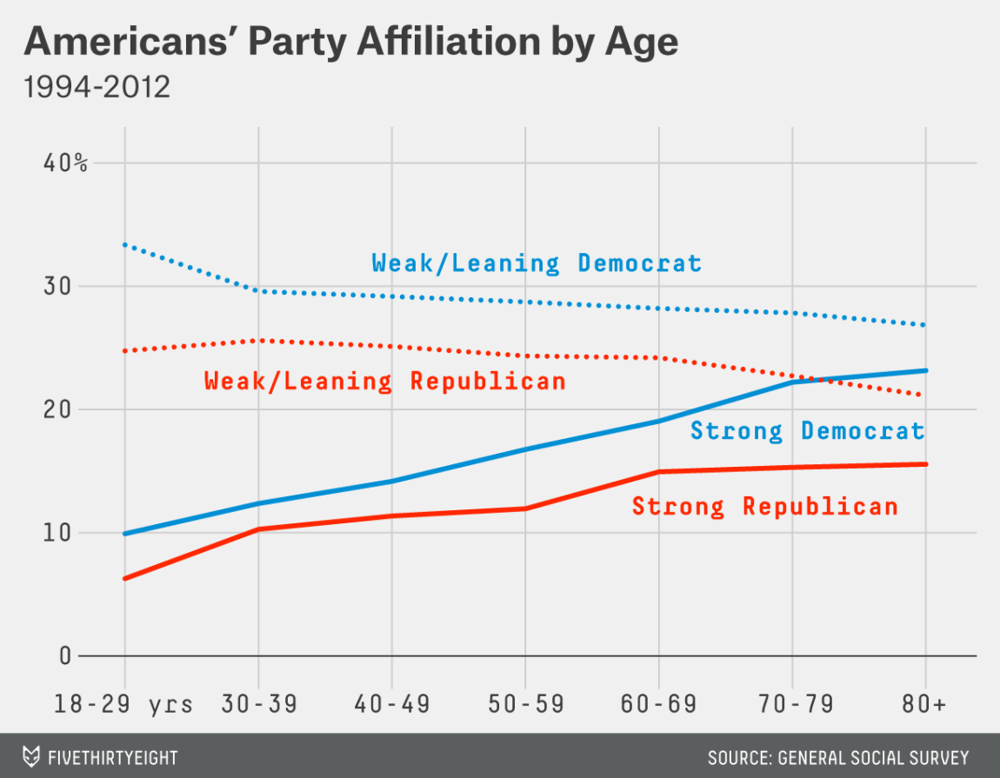

**Starting materials.**
```{r}
library(tidyverse)
library(modelr)
library(stringr)
library(caret)

set.seed(0)

data("mtcars")
car_names = rownames(mtcars)
mtcars_df = as.tibble(mtcars)
mtcars_df$name = car_names
```

**1.** Using `mtcars_df`, select all the columns with the letter "a" in the title.

```{r}

```

**2.** What is the average MPG and HP for cars with either 6 or 8 cylinders? 

```{r}

```

**3a.** Write a function called `ratio_1` that takes an `mpg` value and a `cyl` value and calulates the `mpg` per `cyl` value.

```{r}

```

**3b.** Write a for loop that operates over the rows of `mtcars`. During each iteration, pass the values of `mpg` and `cyl` to your function `ratio_1`. Store the results and at the end of the for loop, add a new column called `mpg_per_cyl` to `mtcars` with the values calculated by `ratio_1`. 

```{r}

```

**3c.** Which car has the highest `mpg_per_cyl` score? Sort the dataframe to find the answer.

```{r}

```

**4.**  Read in the file "practice_data/librarians-by-msa.csv" to a tibble called `librarians_df` (sourced from [FiveThirtyEight](https://github.com/fivethirtyeight/data/tree/master/librarians)). Make sure numeric columns are read in correctly.

```{r}
librarians_df = read_csv('practice_data/librarians-by-msa.csv', na = '**')
head(librarians_df)
```

**5.** Read in the file "practice_data/congress_terms.csv" to a tibble called `congress_df` (sourced from [FiveThirtyEight](https://github.com/fivethirtyeight/data/tree/master/congress-age)). 

```{r}

```

**6a.** From `librarians_df` create a dataframe with an average `jobs_1000` value for each state. Call this dataframe `state_lib_1000_df`. Rename `prim_state` to `state`.

```{r}

```

**6b.** Left join `congress_df` with `state_lib_1000_df` on the `state` variable. Identify congressmen `lastnames`, `party`, `state`, and `congress` from states with the most and fewest librarians per 1000. Only include the most recent congress in the data set.

```{r}

```

**7.** Fit a linear model that predicts number of librarians per 1000 people `jobs_1000` from total librarians employed `tot_emp`. Plot the model predictions as a red line overlayed on a scatterplot of the raw data. 

```{r}

```

**8.** Write a function `rmm` that removes any words starting with "M" from a phrase, and returns the new phrase.

```{r}

```

**8b.** Apply the function `rmm` to the `area_name` column in the `librarians_df` dataframe, and save as a new column `no_m_area_name`.

```{r}

```

**9a.** Scale and center the numerical columns of `librarians_df` and then cluster using heirarchical clustering with the "ward" method. Plot the dendrogram. 

```{r}
hclust_sol = librarians_df %>% 
  select(tot_emp, emp_prse, jobs_1000, loc_quotient) %>%
  na.omit() %>%
  preProcess(method=c("center", "scale")) %>%
  predict(librarians_df) %>%
  na.omit() %>%
  dist() %>%
  hclust(method="ward")

plot(hclust_sol)
```

**9b.** Based on the dendrogram, select a reasonable number of clusters and assign all the datapoints to a cluster. Produce a scatterplot where points are colored by cluster membership. 

```{r}

o = cutree(hclust_sol, k=2)

librarians_df %>%
  na.omit() %>%
  mutate(cluster=o) %>%
  ggplot(aes(tot_emp, emp_prse)) +
  geom_point(aes(color=cluster))

```


**10.** Write an informative title for this figure. State a conclusion from the data rather than descibing "what" the figure is. Image courtesy of [FiveThirtyEight](https://fivethirtyeight.com/features/both-republicans-and-democrats-have-an-age-problem/)


```{}

```

**11.** What is the docker command to list running containers?

```{}

```

**12a.** Consider the following shell script:
```{}
#!/usr/bin/env bash

docker run -d --rm -v /home/user/test:/work -w /work python:2.7 $@

```


What does the "$@" mean? 

```{}

```

**12b.** What is the name of the docker container being run in the shell script?

```{}

```

**13.** What is the bash command to delete a directory `dir_name` full of files?

```{}

```


**14.** Given an existing python dictionary `D = {'a':1, 'b':62, 'c':9, 'd':13}`, how would you add a new key:value pair "'e':8" without re-creating the whole dictionary?

```{}

```

*15** Given a string "s = 'Spaghetti carbonara and parmessian cheese`", what would be the result of executing the following python code, and why? 

`S.find("bonara")`

```{}

```

**16.** Given a Pandas Dataframe like `librarians_df`, how would you use a for loop to calculate the average `jobs_1000` per state?

```{}

```

**17.** Given the following Makefile, what is the sequence of events that would happen if the user 
typed the phrase `make histogram.png`? Describe which targets would run, scripts that would run, and files that would be created.

```{}
raw.tsv:
  curl -o raw.tsv http://fakedata.unc/data.tsv
  
data.csv: raw.tsv
  Rscript format_data.R raw.tsv

histogram.png: data.csv
  docker run -d -v $(shell pwd):/work -w /work rocker/tidyverse Rscript plot_maker.R data.csv

```

```{}

```


**18a.** Consider the example [Nextflow script from class](https://github.com/biodatascience/datasci611/blob/gh-pages/scripts/nextflow_example1/main.nf).
  
In the process `get_seq_length`, what does "$f" refer to? 

```{}

```

*18b.** In what order will files be processed by `get_seq_length`?

```{}

```

